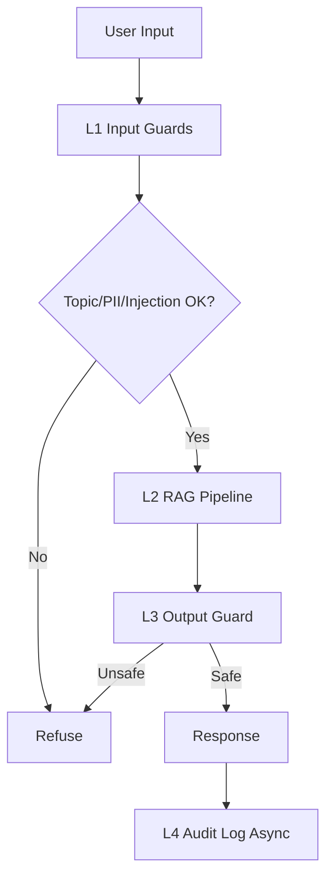

# Production Blueprint

## SLOs
| Metric | Target | Alert Threshold | Severity |
|---|---|---|---|
| Faithfulness | >=0.85 | <0.80 for 30 min | P2 |
| Answer Relevancy | >=0.80 | <0.75 for 30 min | P2 |
| Context Precision | >=0.70 | <0.65 for 1h | P3 |
| Context Recall | >=0.75 | <0.70 for 1h | P3 |
| P95 Latency | <2500ms | >3000ms for 5 min | P1 |
| Guardrail Detection Rate | >=90% | <85% | P2 |
| False Positive Rate | <5% | >10% for 1h | P2 |
| PII Redaction Recall | >=80% | <70% | P2 |

## Architecture Diagram

## Alert Playbook
### Incident: Faithfulness drops < 0.80
**Severity:** P2  
**Detection:** Continuous eval gate or batch monitoring  
**Likely causes:** Retrieval drift, prompt drift, stale index  
**Resolution:** Re-index, compare prompt version, inspect context precision

### Incident: Adversarial detection rate drops < 0.85
**Severity:** P2  
**Detection:** Daily attack suite  
**Likely causes:** Heuristic gaps, new jailbreak phrasing  
**Resolution:** Extend rules, add nano fallback, refresh attack corpus

### Incident: P95 latency > 3s
**Severity:** P1  
**Detection:** Benchmark or runtime monitor  
**Likely causes:** Slow LLM, serial execution, network latency  
**Resolution:** Parallelize guards, reduce context length, retry budget tuning

## Cost Analysis

Assumption: 100,000 queries/month, avg 500 tokens input + 200 tokens output.

| Component | Model | Unit Cost | Volume | Monthly Cost |
|---|---|---|---|---|
| RAG generation (gpt-4o-mini) | gpt-4o-mini | $0.001/q | 100k | $100 |
| RAGAS continuous eval (1% sample) | gpt-4o-mini | $0.012/q | 1k | $12 |
| LLM Judge T2 (pairwise) | gpt-4o-mini | $0.001/q | 10k | $10 |
| LLM Judge T3 (spot-check) | gpt-4o | $0.05/q | 1k | $50 |
| Input Guard (Presidio self-hosted) | regex/NER | $0 | 100k | $0 |
| Output Guard (Llama Guard via Groq) | llama-guard-3-8b | $0.0002/q | 100k | $20 |
| Embedding (text-embedding-3-small) | OpenAI | $0.00002/1k tok | 100k | $1 |
| **Total** | | | | **~$193/month** |

## Cost Optimization Opportunities
- Tier judge: spot-check only bottom 10% by RAGAS score → save $40/month.
- Groq free tier covers first 14,400 LlamaGuard requests/day → $0 for low traffic.
- Cache embedding vectors for repeated queries → save 30-40% embedding cost.
- Sample eval at 0.5% instead of 1% if metrics are stable → halve eval cost.

## Optimization Ideas
- Sample eval traffic instead of full continuous scoring.
- Keep deterministic guards first, nano fallback only for ambiguous cases.
- Reuse cached answers during judge experiments to cut repeat API calls.
